# Can XAI Methods Reliably Identify What a Model Learned?

> **CS 667 — Deep Learning Course Project · Spring 2026 · IIT Gandhinagar**

A systematic comparative evaluation of four Explainable AI (XAI) methods across four neural architectures, assessed on five quantitative metrics with statistical testing, sanity checks, and qualitative heatmap analysis.

---

## Research Question

> *Can existing XAI methods reliably identify what a model actually learned, or do they reflect dataset bias and architecture artefacts?*

**Short answer:** Partially — and the failures are predictable. IntGrad and LIME together form the most reliable combination, but both are shaped by the model's architecture. Interpretable-by-design architectures (BagNet-33) improve reliability more robustly than method selection alone.

---

## Authors

| Name | Email |
|---|---|
| Sankalp Sunil Turankar | sankalp.turankar@iitgn.ac.in |
| Parv Thacker | parv.thacker@iitgn.ac.in |
| Parth Dangi | parth.dangi@iitgn.ac.in |

---

## Project Overview

We evaluate **4 XAI methods** on **4 neural architectures** using **5 quantitative metrics** across **20 Imagenette validation images** (2 per class, 10 classes), producing **320 total attribution evaluations**.

### Models

| Model | Architecture | Top-1 Accuracy |
|---|---|---|
| VGG-16 | Sequential CNN, 16 layers, no skip connections | 71.6% |
| ResNet-50 | Residual CNN, 50 layers, skip connections | 76.1% |
| ViT-B16 | Vision Transformer, patch tokens, global attention | 81.1% |
| BagNet-33 | Local-RF CNN, 33×33 receptive field, patch-additive logits | ~70% |

### XAI Methods

| Method | Type | Key Property |
|---|---|---|
| GradCAM | Gradient-based | Reads CNN spatial feature maps; incompatible with ViT |
| IntGrad | Gradient-based | Path-integrated gradients; satisfies completeness axiom |
| LIME | Perturbation-based | Model-agnostic; superpixel-level attribution |
| KernelSHAP | Game-theoretic | Shapley values on superpixels |

### Evaluation Metrics

| Metric | What It Measures |
|---|---|
| **Faithfulness** | Confidence drop after removing top-k% attributed pixels (k = 10, 20, 30%) |
| **AOPC** | 10-step deletion curve (5–50%); more statistically stable than faithfulness |
| **Sufficiency** | Confidence retained when keeping only top-k% attributed pixels |
| **Sparsity** | Fraction of pixels above attribution threshold 0.5 — lower = more focused |
| **Stability** | Cosine similarity across 10 noise-perturbed inputs (σ = 0.05) |

---

## Key Results

### Faithfulness — All 4 Architectures

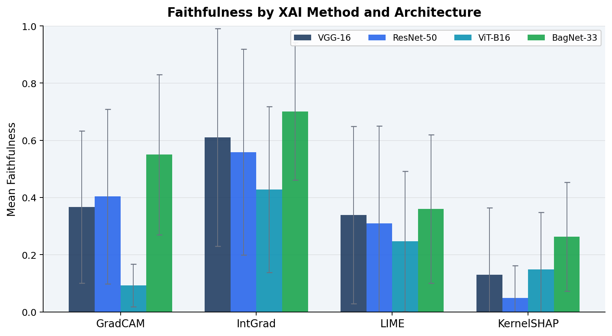

IntGrad leads on every architecture. BagNet-33 IntGrad (0.701) is the highest single score in the study — 15% above the best CNN result. KernelSHAP on ResNet-50 (0.048) produces negative faithfulness in 18.75% of cases, meaning removing its top-attributed pixels *increases* model confidence.

---

### ANOVA: Method Choice Dominates Architecture

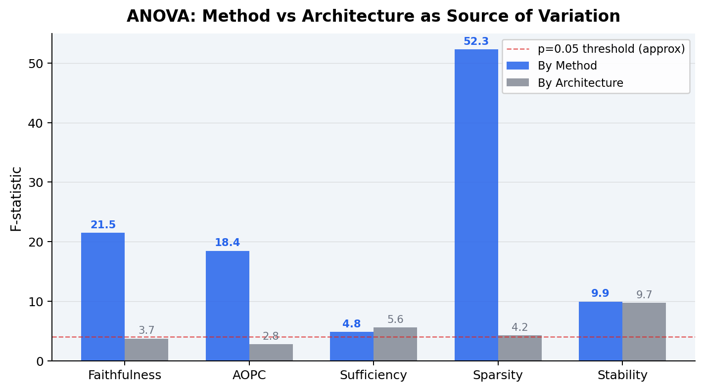

ANOVA F-statistic by method (21.50) is **5.8× higher** than by architecture (3.70). Switching from KernelSHAP to IntGrad improves faithfulness by up to **10×**, regardless of which model is used.

---

### Faithfulness Ranking — All Combinations

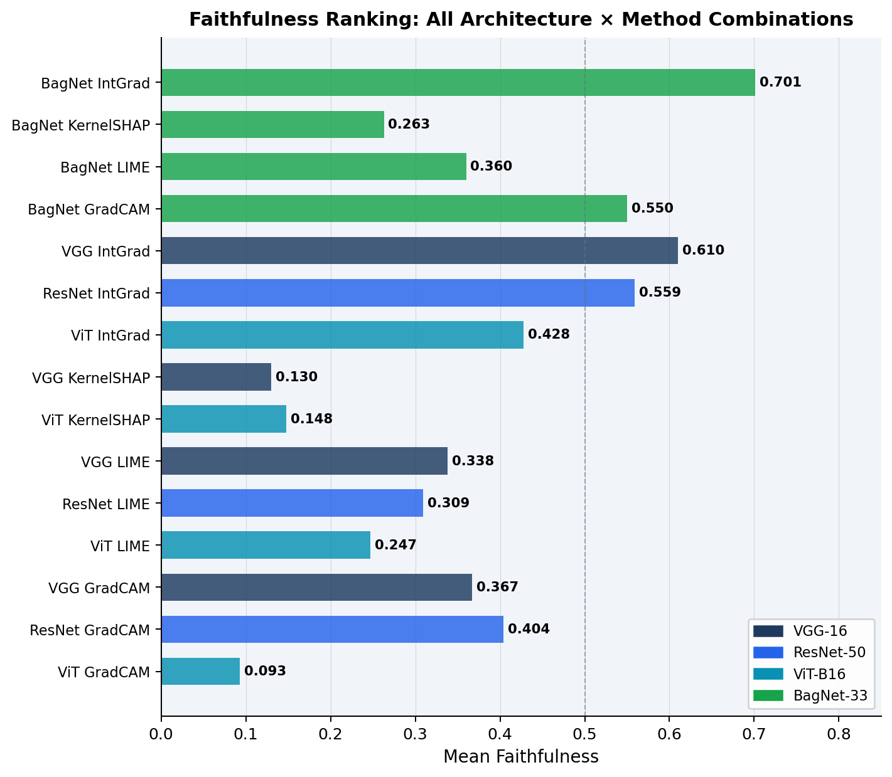

BagNet-33 occupies **4 of the top 7 positions**, confirming that interpretable-by-design architecture lifts multiple XAI methods simultaneously — not just GradCAM.

---

### Necessity vs Sufficiency Gap

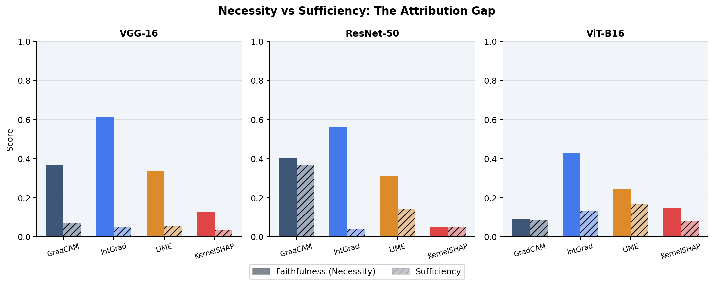

IntGrad finds pixels that are *necessary* but not *sufficient*. GradCAM's coarser coverage retains enough spatial context to maintain partial confidence when everything else is masked. The model distributes decisions across more pixels than any attribution map captures.

---

### Stability Heatmap

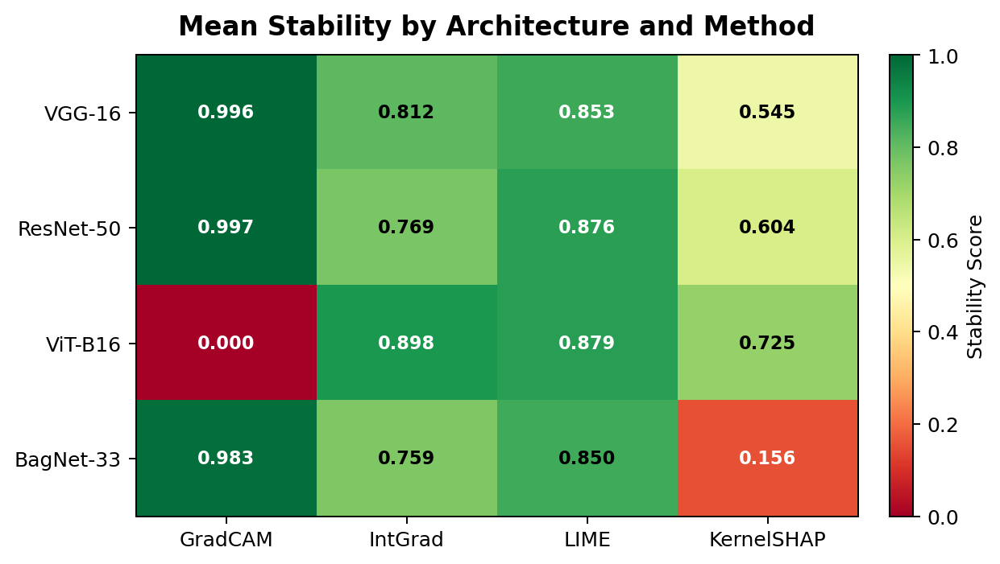

GradCAM is deterministically stable on CNNs (≈0.997). KernelSHAP is least stable (0.156–0.725). ViT-B16 GradCAM shows 0.000 — not genuine instability, but undefined cosine similarity between zero vectors.

---

### Metric Independence

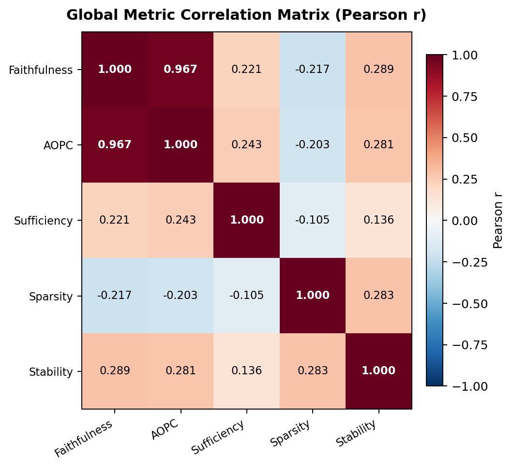

Only Faithfulness ↔ AOPC is redundant (r = 0.967). All other 9 metric pairs are genuinely independent (|r| < 0.30), validating the five-metric framework.

---

### Attribution Sparsity

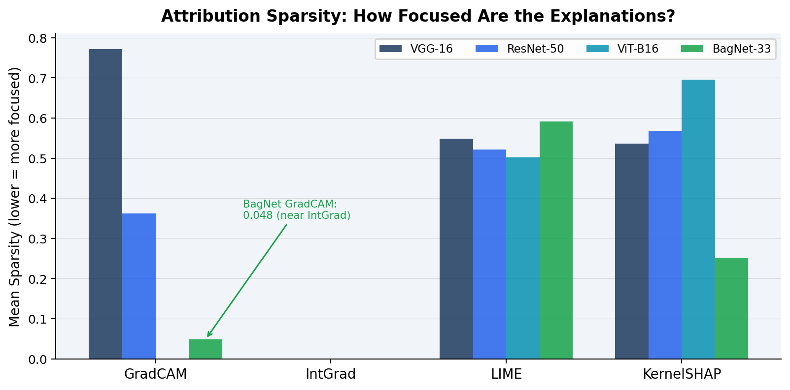

VGG-16 GradCAM (0.772) highlights 77% of pixels — almost the entire image. BagNet-33 GradCAM (0.048) approaches IntGrad-level precision due to its constrained 33-pixel receptive field.

---

### Cross-Architecture Attribution Agreement

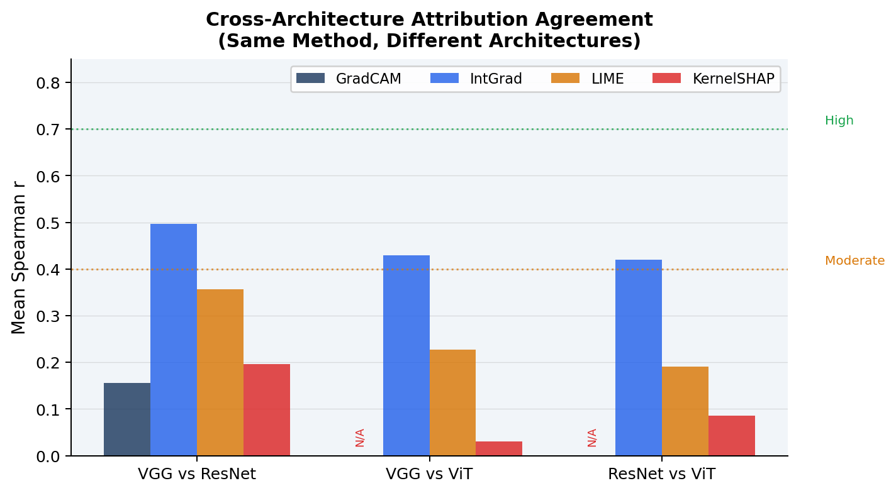

IntGrad achieves moderate cross-architecture agreement (Spearman r: 0.42–0.50), suggesting its attributions partly reflect shared image semantics. KernelSHAP shows near-zero agreement (0.03–0.20), consistent with its instability.

---

### Sanity Checks

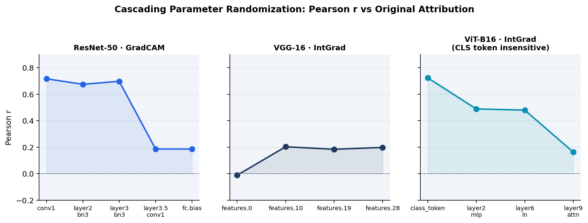

A reliable method should show Pearson r → 0 as model weights are progressively randomised. ViT-B16 GradCAM produces NaN (zero maps). ViT-B16 IntGrad stays high at the CLS token layer (r = 0.724), revealing the gradient path bypasses the primary classification mechanism.

---

## Qualitative Case Studies

### Case Study 1 — Tench: Spurious Correlation Exposed

CNNs attribute to the **angler**, not the fish. BagNet-33 correctly identifies the **fish body** because its 33-pixel window cannot encode the full-scene co-occurrence.

| ResNet-50 — focuses on angler ✗ | BagNet-33 — focuses on fish ✓ |
|---|---|
| 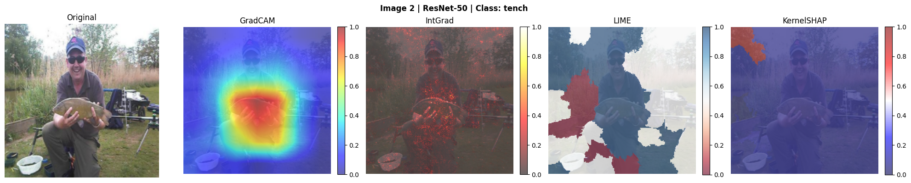 | 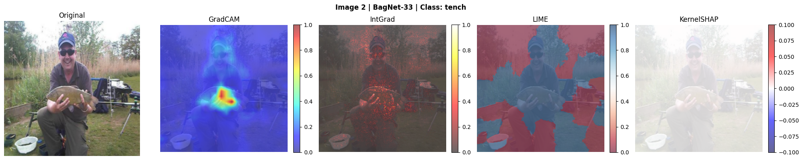 |

> Faithfulness: ResNet-50 GradCAM = 0.954 (angler) · BagNet-33 GradCAM = 0.952 (fish body)

---

### Case Study 2 — Chain Saw: Architecture Effect on Bias

ResNet-50 attributes to the **worker**; ViT-B16 IntGrad correctly attributes to the **chain saw blade** (faithfulness 0.862). Global attention captures context-independent features that CNN local filters miss.

| ResNet-50 — worker (faith: 0.161) | ViT-B16 — blade (faith: 0.862) |
|---|---|
| 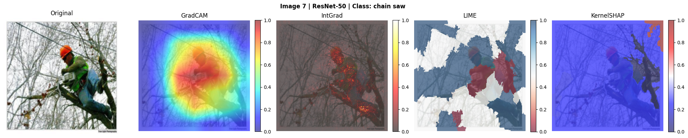 | 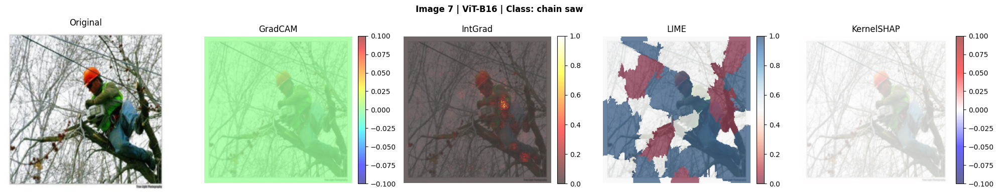 |

---

### Case Study 3 — Gas Pump: Text as a Spurious Feature

GradCAM and IntGrad both highlight the **"PLEASE PREPAY" sign**, not the pump structure. The model learned to identify gas pumps by signage, not mechanical form.

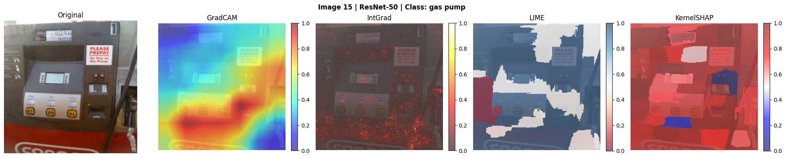

> IntGrad faithfulness = 0.884 — correct explanation of wrong learning.

---

### Case Study 4 — GradCAM Complete Failure on ViT-B16

GradCAM produces a **uniform zero map** across all 20 test images on ViT-B16. This is a mathematical incompatibility — not a bug or tuning issue.

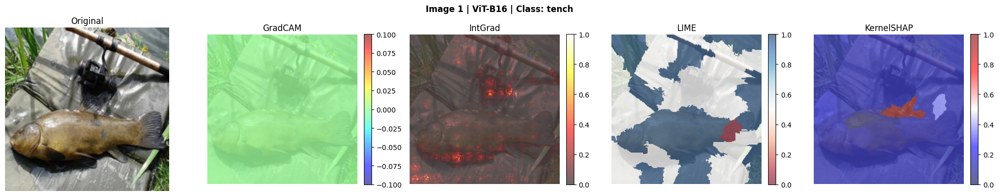

> Sparsity = 0.000 · Stability = 0.000 · Sanity Pearson r = NaN

---

### Case Study 5 — Garbage Truck: XAI Working Correctly

All four methods converge on the **rear compactor mechanism** — the mechanically distinctive part of the vehicle.

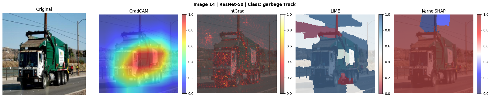

> Faithfulness = 0.951 · Sufficiency = 0.367 (highest in study)

---

## Quantitative Summary

### Faithfulness (mean ± std)

| Architecture | GradCAM | IntGrad | LIME | KernelSHAP |
|---|---|---|---|---|
| VGG-16 | 0.367 ± 0.266 | **0.610** ± 0.380 | 0.338 ± 0.310 | 0.130 ± 0.235 |
| ResNet-50 | 0.404 ± 0.305 | **0.559** ± 0.360 | 0.309 ± 0.341 | 0.048 ± 0.113 |
| ViT-B16 | 0.093 ± 0.075 | **0.428** ± 0.290 | 0.247 ± 0.245 | 0.148 ± 0.200 |
| BagNet-33 | 0.550 | **0.701** | 0.360 | 0.263 |

### Sparsity (lower = more focused)

| Architecture | GradCAM | IntGrad | LIME | KernelSHAP |
|---|---|---|---|---|
| VGG-16 | 0.772 | **0.001** | 0.548 | 0.537 |
| ResNet-50 | 0.362 | **0.001** | 0.522 | 0.568 |
| ViT-B16 | 0.000* | **0.001** | 0.502 | 0.695 |
| BagNet-33 | **0.048** | 0.001 | 0.591 | 0.252 |

*Zero maps — not interpretable as focused.

### Stability

| Architecture | GradCAM | IntGrad | LIME | KernelSHAP |
|---|---|---|---|---|
| VGG-16 | **0.996** | 0.812 | 0.853 | 0.545 |
| ResNet-50 | **0.997** | 0.769 | 0.876 | 0.604 |
| ViT-B16 | 0.000* | **0.898** | 0.879 | 0.725 |
| BagNet-33 | **0.983** | 0.759 | 0.850 | 0.156 |

### ANOVA F-Statistics

| Factor | Faithfulness | AOPC | Sufficiency | Sparsity | Stability |
|---|---|---|---|---|---|
| By Method | 21.50 *** | 18.45 *** | 4.85 ** | 52.32 *** | 9.92 *** |
| By Architecture | 3.70 * | 2.78 | 5.56 ** | 4.25 * | 9.70 *** |

`*** p<0.001  ** p<0.01  * p<0.05`

---

## Key Findings

**1. Method choice dominates architecture**
ANOVA F = 21.50 by method vs 3.70 by architecture. Choosing IntGrad over KernelSHAP improves faithfulness by up to 10× regardless of model.

**2. XAI faithfully exposes dataset bias**
Tench → angler, chain saw → worker, gas pump → payment text. All high-confidence (≥99%), all technically faithful, all revealing wrong learning. XAI reveals bias; it cannot fix it.

**3. GradCAM is architecturally incompatible with ViT-B16**
Zero maps across all 20 images. Not a bug — a fundamental mismatch between GradCAM's ReLU thresholding and attention-based token representations.

**4. BagNet-33 achieves the best XAI reliability**
IntGrad faithfulness 0.701 (best in study). GradCAM sparsity 0.048 (near IntGrad precision). Correctly identifies fish body where CNNs focus on the angler.

**5. All methods fail under model uncertainty**
Low-confidence predictions yield near-zero or negative faithfulness across all methods and architectures.

**6. Metric framework is non-redundant**
9 of 10 metric pairs are genuinely independent (|r| < 0.30). Only Faithfulness ↔ AOPC is redundant (r = 0.967).

### Final Remark
> Out of all methods, **IntGrad and LIME can be used together** to explain the contribution of each feature — but their results are influenced by the model's architecture.

---

## Repository Structure

```
DL_project/
│
├── DL_Project_final (1).py     # Full evaluation pipeline
├── xai_analysis_report.xlsx    # All quantitative results (10 sheets)
├── bagnet.zip                  # BagNet-33 heatmaps + Excel results
├── Pitch deck_DL (1).pptx      # Final presentation (19 slides)
├── README.md
│
├── images/                     # All figures and heatmaps
│   ├── fig1_faithfulness.png
│   ├── fig2_necessity_sufficiency.png
│   ├── fig3_anova.png
│   ├── fig4_stability_heatmap.png
│   ├── fig5_sparsity.png
│   ├── fig6_metric_corr.png
│   ├── fig7_attribution_agreement.png
│   ├── fig8_ranking.png
│   ├── fig9_sanity.png
│   ├── tench_resnet.png
│   ├── tench_bagnet.png
│   ├── chainsaw_resnet.png
│   ├── chainsaw_vit.png
│   ├── gaspump_resnet.png
│   ├── vit_gradcam_fail.png
│   └── garbage_resnet.png
│
└── xai_heatmaps/               # Full heatmap set (60 images)
    ├── img{01-20}_vgg16.png
    ├── img{01-20}_resnet50.png
    └── img{01-20}_vitb16.png
```

### Image–Class Mapping (xai_heatmaps/)

| Image # | Class | Image # | Class |
|---|---|---|---|
| img01–02 | tench | img11–12 | French horn |
| img03–04 | English springer | img13–14 | garbage truck |
| img05–06 | cassette player | img15–16 | gas pump |
| img07–08 | chain saw | img17–18 | golf ball |
| img09–10 | church | img19–20 | parachute |

---

## Setup and Usage

### Requirements

```bash
pip install torch torchvision captum shap lime scikit-image \
            pandas openpyxl matplotlib seaborn scipy numpy tqdm
```

> CUDA recommended. The pipeline runs on CPU but is significantly slower.

### Running the Pipeline

```bash
python "DL_Project_final (1).py"
```

The script will:
1. Download Imagenette validation set automatically
2. Load pretrained VGG-16, ResNet-50, ViT-B16, and BagNet-33
3. Run GradCAM, IntGrad, LIME, and KernelSHAP on all 20 images
4. Compute all 5 metrics per attribution map
5. Save heatmaps to `./xai_heatmaps/`
6. Save a rolling checkpoint (`xai_checkpoint.pkl`) every 5 images
7. Export results to `xai_analysis_report.xlsx`

### Resuming from Checkpoint

```python
import pickle, collections

ck = pickle.load(open("xai_checkpoint.pkl", "rb"))
results        = collections.defaultdict(list, ck["results"])
sanity_results = collections.defaultdict(list, ck["sanity_results"])
stored_attrs   = ck["stored_attrs"]
heatmap_files  = ck["heatmap_files"]
```

---

## Implementation Notes

**ViT-B16 GradCAM** — We implement a hook-based variant that strips the CLS token, reshapes 196 patch tokens to a 14×14 grid, and bilinearly upsamples. Despite this, GradCAM produces zero maps on all images due to a fundamental incompatibility between its ReLU thresholding and attention-based token representations.

**KernelSHAP memory** — Predictions are chunked into batches of 32 to prevent GPU OOM at 750 samples × 50 superpixels.

**BagNet-33** — Run separately. Results in `bagnet.zip` (heatmaps) and in `xai_analysis_report.xlsx`.

---

## Limitations

- 20 images — sufficient for comparison, not per-class statistical significance tests
- IntGrad `n_steps=75` (standard: 300); LIME/SHAP `n_samples=750` (standard: 10,000)
- Zero baseline only for IntGrad; alternative baselines not evaluated
- Attention rollout and DINO self-attention not evaluated for ViT-B16
- BagNet-33 accuracy–interpretability tradeoff not quantified

